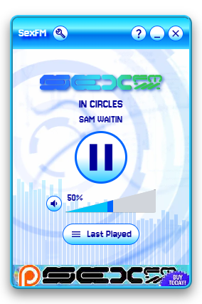
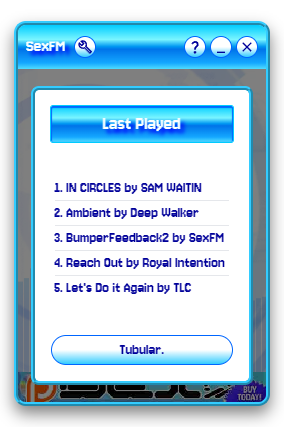
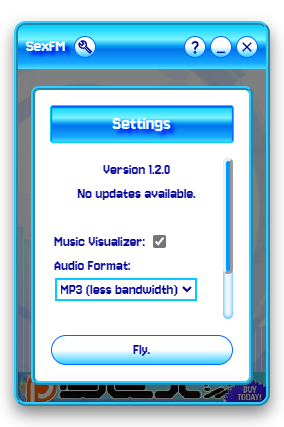

# SexFM Unofficial Player

This is an Unofficial Player for the internet radio SexFM. Built for Desktop (Windows and Linux) and Web Browsers!

Find the official SexFM website at [sexfm.live](https://sexfm.live).

This app borrows some styles and assets from the real website that was made by [Dot](https://dotagotchi.com/).

## Features
- The radio
- Modern and sleek user interface
- Windows and Linux support
- Web browser support
- Awesome audio visualizer (that you can turn off)
- The 5 last played songs
- Volume control
- Integration with your Operating System's media controls
- No offline support
- Honestly not that lightweight or performant oops
- Auto-update support (that hopefully works)

## Screenshots

## Todo
- better metadata
- system tray support
- PWA
- discord rich presence support

## Development

Install Node and Rust, npm deps, then do `yarn tauri dev` or `yarn tauri build` using your favourite package manager.
